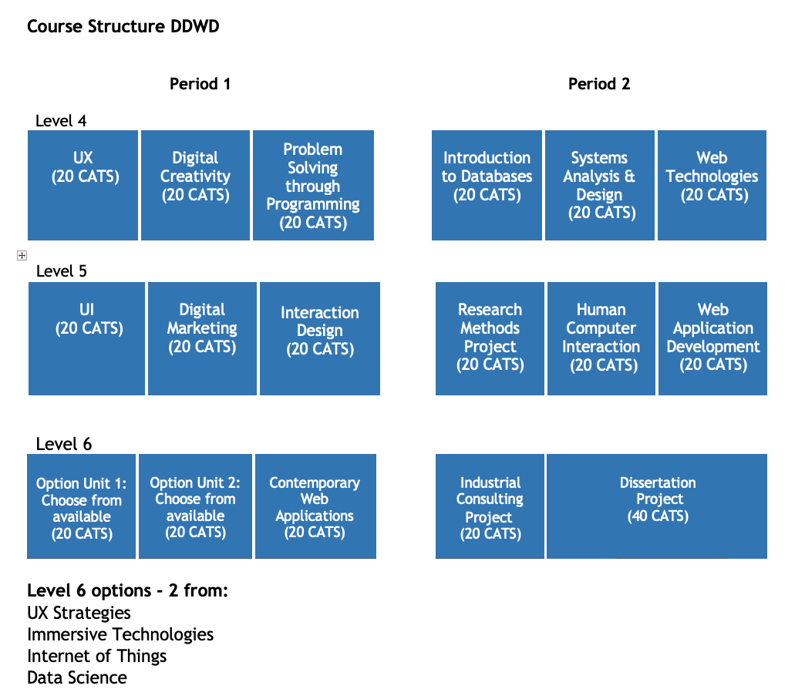
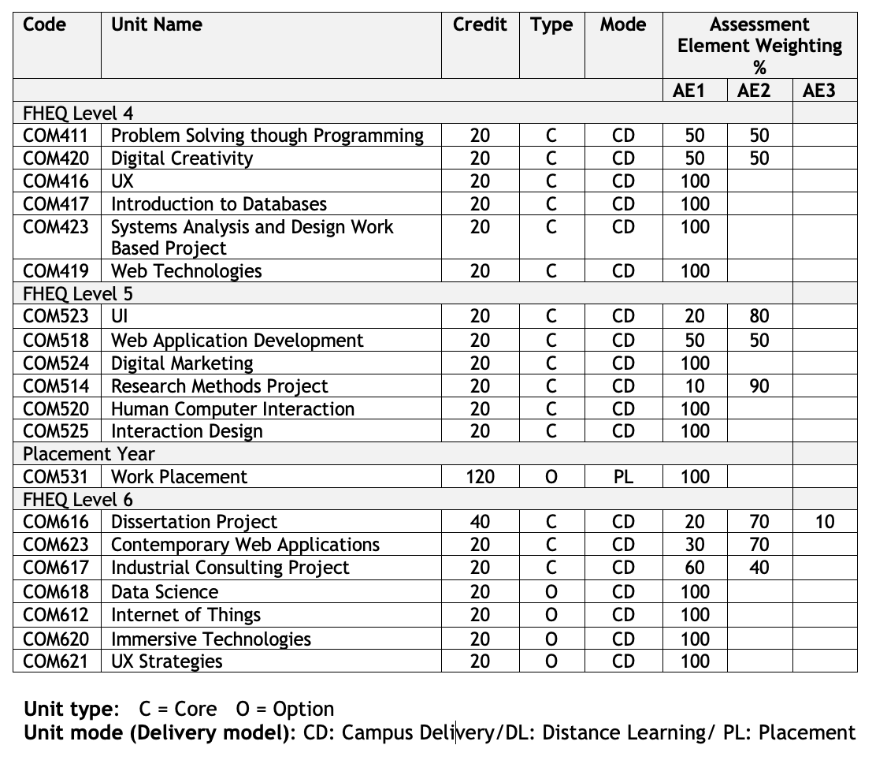
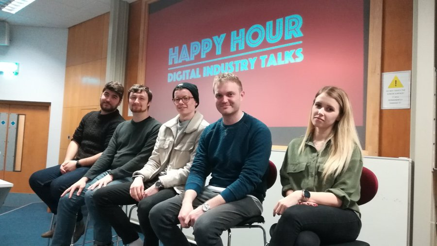

# BSc Digital Design & Web Development 

[Skip Barden DDWD Class of 2021](https://www.solent.ac.uk/news/solent-team-achieve-innovation-award-at-international-hackathon)

**Passionate about design? An interest in creating digital platforms that provide an excellent user experience (UX)? This digital design and web development degree blends creative and technical skills, preparing you for an exciting career in digital communications.**

<iframe width="560" height="315" src="https://www.youtube.com/embed/Kergnync_x4" title="YouTube video player" frameborder="0" allow="accelerometer; autoplay; clipboard-write; encrypted-media; gyroscope; picture-in-picture" allowfullscreen></iframe>

The course maintains a strong practical emphasis with a key focus on UX and usability – and you’ll be introduced to professional design and development workflows, user research, gathering requirements, sketching ideas, creating concepts, building prototypes, undertaking user experience (UX) evaluation and finally coding up digital products and applications.

You will also be guided to promote yourself as a professional practitioner by developing online profiles to showcase your skills and expertise, and will be encouraged to attend local networking events to gain invaluable real-world experience and feedback.

[BSc Digital Design & Web Development](https://www.solent.ac.uk/courses/undergraduate/digital-design-and-web-development-bsc)

## Course Leader Introduction

The [BSc Digital Design & Web Development](https://www.solent.ac.uk/courses/undergraduate/digital-design-and-web-development-bsc) offers contemporary digital design and technology skills that are found in a broad range of jobs roles within creative, retail, finance, music, publishing, media, public and charity sectors, manufacturing and professional services.

The course maintains a strong practical focus, and students are introduced to professional design and development workflows, user research, gathering requirements, sketching ideas, creating concepts, building prototypes, undertaking user experience evaluation and finally coding up digital applications.

The Digital Design & Web Development BSc course will offer a solid grounding in digital and user interface design (UI), user experience (UX), front-end (client-side) and back-end development (server-side), interaction design, digital marketing, project management and an Industrial Consulting Project.

<iframe src="https://solent.cloud.panopto.eu/Panopto/Pages/Embed.aspx?id=149a2ce1-8eea-4ec4-9c3d-ac3a00f60948&autoplay=false&offerviewer=true&showtitle=true&showbrand=false&start=0&interactivity=all" height="405" width="720" style="border: 1px solid #464646;" allowfullscreen allow="autoplay"></iframe>

Assessment and Learning activities will focus on problem-solving, project work, user-centred design and user experience of evaluation. Students are guided into promoting themselves as professional practitioners by developing online profiles, which showcase their skills and expertise. As well as supporting and encouraging engagement in networking at local digital and technology events to gain invaluable real-world experience and feedback.

Our industry links will support you in gaining contacts, work experience and offer you an insight into life in digital after graduation by having regular speakers at our ‘Happy Hour Digital Industry’ talks.

Industrial consulting is enabled through our final year unit which gets students industry ready to confidently go forward into the workplace.

Graduates will be able to pursue a wide range of careers options in digital product design and service design, disciplines as user experience (UX) practitioners, user interface designers (UI), interaction design, web front-end and back-end developers.

 Whatever their chosen career Digital Design & Web Development graduates will be comfortable working in a multi-disciplined work environment by understanding other fields of practice within the digital and technology industries.

[Martin Reid ](https://www.solent.ac.uk/staff-profiles/academic-profiles/martin-reid/martin-reid)- Course Leader BSc Digital Design & Web Development

## Jack Pritchard WebDev class of 2019 gives his experience of studying at Solent

<iframe src="https://solent.cloud.panopto.eu/Panopto/Pages/Embed.aspx?id=e8fb2bf2-ce58-4b62-8cf0-a965009027ac&autoplay=false&offerviewer=true&showtitle=true&showbrand=false&start=0&interactivity=all" height="405" width="720" style="border: 1px solid #464646;" allowfullscreen allow="autoplay"></iframe>

See what Jack is doing now: [linkedin.com ](https://www.linkedin.com/in/whatjackhasmade/)and[whatjackhasmade.co.uk](https://whatjackhasmade.co.uk/)

In 2020 we refreshed and renamed BSc Web Design and Development course to [BSc Digital Design & Web Development](https://www.solent.ac.uk/courses/undergraduate/digital-design-and-web-development-bsc)

## Course Map

### Module Breakdown

### 1st Year (Level 4)
**Problem Solving Though Programming COM411** - This module will introduce you to software implementation through the process of understanding how to solve problems using programming. 

**Digital Creativity COM420** - This module focuses on the practical skills needed to produce design components for both hardcopy and digital interactive interfaces. 

**UX COM416** - On this module, you will learn the techniques (Qualitative and Quantitative) and tools to design, plan and develop a user research strategy. 

**Introduction to Databases COM417** - In this module you are introduced to the skills and concepts required to develop and use relational databases. You will learn how to write programs interacting with databases and how to create them. 

**Systems Analysis and Design COM423** - In this module, the key components of business information systems are identified and dissected to reveal the essential elements considered in systems analysis.

**Web Technologies COM419** - On this module, you’ll be introduced to common client server-side scripting technologies used in the development of web applications, such as HTML, CSS, JavaScript, and PHP.

### 2nd Year (Level 5)
**UI COM523** - On this module you will learn current workflows for creating prototypes for digital products that solve a design problem by gathering requirements, creating design systems and building prototypes that will be tested and evaluated for usability. 

**Web Application Development COM518** - This module extends the fundamentals of server-side web development first encountered in ‘Developing for the Internet’ with a look at the technologies necessary to develop the highly-interactive and mobile-compatible web applications in use today.

**Digital Marketing COM524** - This module will help you learn how to design a digital marketing strategy for small to medium enterprises to reach out to more customers and sell more.

**Research Methods Project COM514** - This module will align you with the forefront of scientific knowledge, and, in doing so, you will hone your research skills.
Human-Computer Interaction COM520 - On this module, you will gain an understanding of the major issues surrounding HCI and solving related design problems. 

**Interaction Design COM525** - Through this module, you will gain knowledge of the underpinning theory and current professional practice in the interaction design discipline.

### 3rd Year (Level 6)
**Dissertation Project COM616** - Your dissertation may be practical or investigative in nature, but all projects must produce specific artefacts that demonstrate your intellectual and practical skills in the subject area.

**Industrial Consulting Project COM623** - The module will deliver ‘Real-world’ learning which involves interaction with employers and external organisations to allow you to prepare, rehearse and reflect on your experiences

**Contemporary Web Applications COM617** - Through this module you will learn how to construct web-applications using a modern industry-aligned approach. 

### Level 6 Options (Choose two)

**Data Science COM618 **- On this module, you will explore the use of visualisations, data cleaning and pre-processing, data science programming libraries, and prediction amongst others. 

**Internet of Things COM612** - By the end of the module, you will have explored how to evaluate, critically analyse and synthesise information, data and ideas and acquired practical skills in the field of the Internet of Things (IoT).

**Immersive Technologies COM620** - On this module you will learn how to design and develop your own prototypes in response to typical immersive scenarios involving virtual reality (VR), augmented reality (AR) or mixed reality (MR).

**UX Strategies COM621** - The module will cover the interdisciplinary nature of UX and the principles of user-centred design.

Please note: Not all optional modules are guaranteed to run each year.

### Work Placement (Between Levels 5 & 6)
You might have started university on the placement pathway or decide later In the second year if you wish to go out and work in the industry for a year between second and third year.

The Course team and also Solent futures will give you all the support in preparing to secure a placement. A placement is a short term contract.

## Happy Hour Digital Industry Talks

[Happy Hour Digital Industry Talks](https://martinsolent.github.io/happyhour20/about.html) are designed to offer an insight into working in the tech and digital industries. Talks are mostly focused on students,  "early career" or how to get into the industry with speakers presenting their journey into the industry and professional practice.

[Happy Hour 2020](https://martinsolent.github.io/happyhour20/)

### WebDevSolent

Please follow our twitter feed [@WebDevSolent ](https://twitter.com/WebDevSolent) this has been set up to support networking between local digital and development companies and students to help improve confidence and employability.

There will be lots of information about meet-ups, conferences and developments in digital design.

